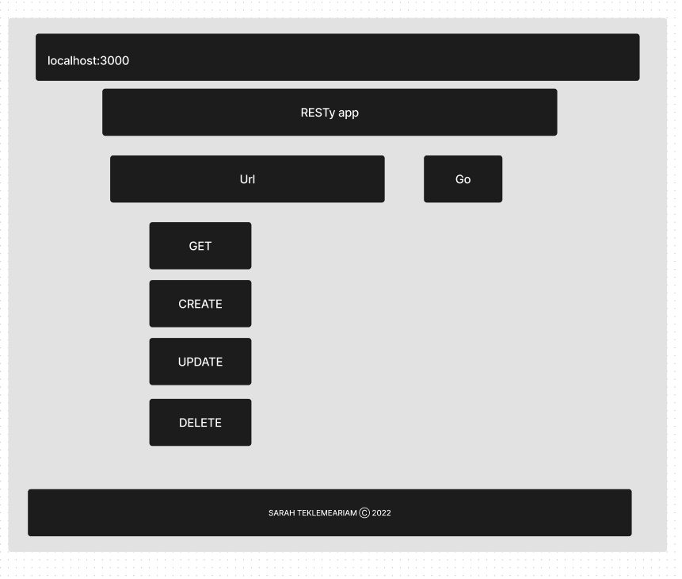

# RESTy

## Phase 1 Requirements

Refactor the RESTy application as follows:

1. Convert all child components of `App.js` from classes to functions

- The `App` component serves as the container for all sub-components of this application.
- Leave this component as a Class.
- Make sure all base styles for `App` are included in a `.scss` imported within `App.js`.
- Ensure that the `Header`, `Footer`, `Results` and `Form` components are imported using ES6 `import` syntax.

2. Use `.scss` files to style each component

- Each of the components use their own `.scss` file for styling.

3. Core application functionality should remain unchanged:

- The `<Form>` component should:
  - Call a function on submit that updates the `<App/>` component via a function sent down as a prop so that the app can process the form values.
- The `<Results/>` component should show mock API results.

## [PR](https://github.com/SarahTek/RESTy/pull/1)

## UML

[CodeSandbox](https://codesandbox.io/p/github/SarahTek/RESTy/csb-ezt0wg/draft/morning-shape?file=%2F.codesandbox%2Ftasks.json&selection=%5B%7B%22endColumn%22%3A1%2C%22endLineNumber%22%3A13%2C%22startColumn%22%3A1%2C%22startLineNumber%22%3A13%7D%5D&workspace=%257B%2522activeFileId%2522%253A%2522cl8sbhbir0011lsi3d07n3v0v%2522%252C%2522openFiles%2522%253A%255B%2522%252FREADME.md%2522%255D%252C%2522sidebarPanel%2522%253A%2522EXPLORER%2522%252C%2522gitSidebarPanel%2522%253A%2522COMMIT%2522%252C%2522sidekickItems%2522%253A%255B%257B%2522type%2522%253A%2522TERMINAL%2522%252C%2522shellId%2522%253A%2522cl8sbjz49000blpi3dm4xf227%2522%252C%2522key%2522%253A%2522cl8sbl04501h03b6icfultlg7%2522%252C%2522isMinimized%2522%253Atrue%257D%255D%257D)

## Collaborators

- Tony
- Danny
- Martha
- Von
